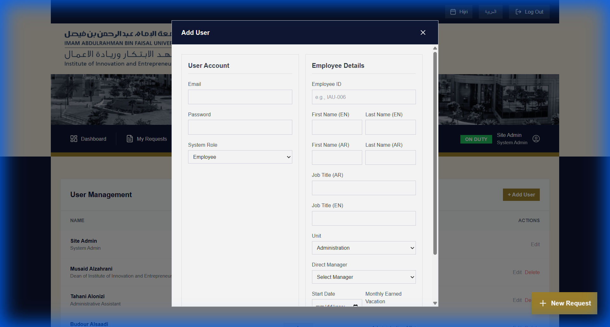
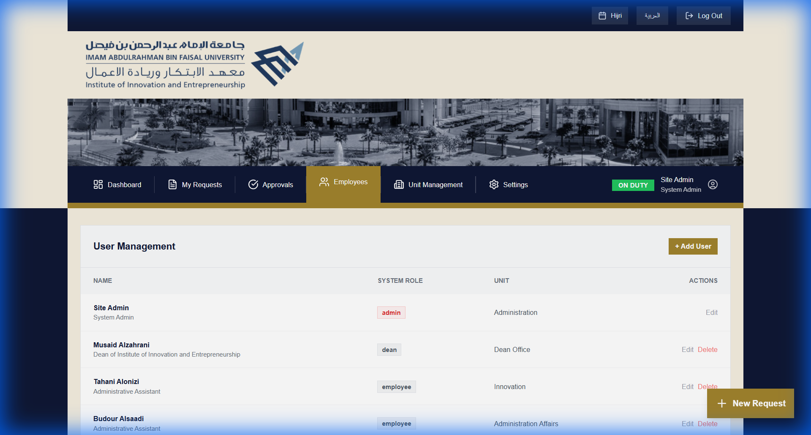
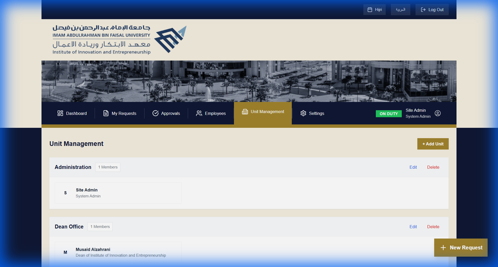
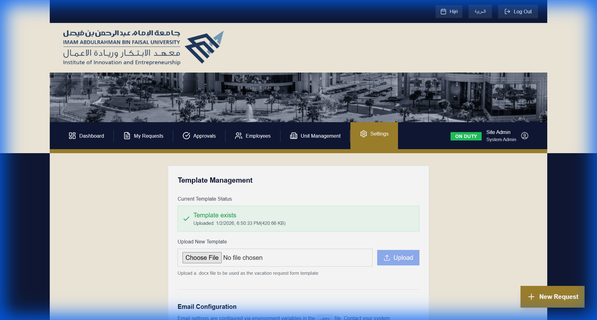

# IAU Portal - Admin & Deployment Guide

## Introduction
This guide is intended for **System Administrators** and the **Deployment Team**. It covers user management, system configuration, and deployment procedures.

> [!NOTE]
> For standard application usage (Leave requests, Approvals), please refer to the **[Basic User Guide](user_guide_basic.md)**.

---

## Part 1: System Administration

### 1. User Management
Admins have full control over the employee database.

#### Adding a New User
1.  Navigate to the **Employees** page.
2.  Click **"+ Add User"**.
3.  Fill in the required details:
    -   **English/Arabic Names**: Required for bilingual support.
    -   **Email**: Determining login ID.
    -   **Role**: `Employee`, `Manager`, `Dean`, or `Admin`.
    -   **Contract details**: Start date, Leave balance.
4.  Click **Create Employee**.



#### Managing Employees
The Employee List provides a quick overview. You can **Edit** details or **Delete** users who have left the organization.


### 2. Organizational Units
Manage the simplified hierarchy (Colleges, Departments, Units).

1.  Navigate to **Units**.
2.  Add or Edit units toassign employees correctly.
3.  **Note**: This affects reporting and filtering.



### 3. System Settings
Configure global parameters.

#### Email Configuration
Navigate to **Settings** > **Email**.
-   **SMTP Provider**: Configure Mailtrap (dev) or Exchange/Office365 (prod).
-   **Templates**: Customize the HTML email sent for approvals.

#### Document Templates
The system uses a `.docx` template for vacation forms.
-   **Template Path**: `backend/templates/vacation_template.docx`
-   **Placeholders**: `{{ employee_name }}`, `{{ duration }}`, etc.



---

## Part 2: Deployment Guide

### Deployment Options Overview
| Option | Best For | Difficulty |
| :--- | :--- | :--- |
| **Docker (Portainer)** | Production | Medium |
| **Manual (Ubuntu)** | Legacy / Specific requirements | Hard |

### Option 1: Docker (Recommended)
We utilize **Docker Compose** for a unified deployment of Frontend (React), Backend (FastAPI), and Database (PostgreSQL).

#### Prerequisites
-   Docker Engine & Docker Compose
-   (Optional) Portainer for GUI management

#### Deployment Steps
1.  **Clone the Repository**:
    ```bash
    git clone https://github.com/addoodi/iau-portal.git
    cd iau-portal
    ```
2.  **Environment Setup**:
    Copy `.env.example` to `.env` and configure:
    -   `SECRET_KEY`: Generate a strong random string.
    -   `POSTGRES_PASSWORD`: db password.
    -   `SMTP_*`: Email usage.
3.  **Run with Compose**:
    ```bash
    docker-compose up -d --build
    ```
4.  **Verify**:
    -   Frontend: `http://localhost:3000`
    -   Backend: `http://localhost:8000/docs`

### Option 2: Manual Deployment (University Server)

#### Backend (Python/FastAPI)
1.  Install Python 3.11+.
2.  Create venv: `python -m venv venv`.
3.  Install deps: `pip install -r requirements.txt`.
4.  Run with Uvicorn:
    ```bash
    uvicorn backend.main:app --host 0.0.0.0 --port 8000
    ```

#### Frontend (React/Vite)
1.  Install Node.js 18+.
2.  Build:
    ```bash
    npm install
    npm run build
    ```
3.  Serve the `dist` folder using Nginx/Apache.

### Troubleshooting

-   **"Network Error"**: Check `VITE_API_URL` matches the deployed backend URL.
-   **Emails not sending**: Verify SMTP port (usually 587 for TLS).
-   **Signatures missing**: Ensure the backend has write permissions to the `/uploads` directory.

---

## Part 3: Maintenance

### Backups
-   **Database**: Periodically dump the PostgreSQL database.
    ```bash
    docker exec -t iau-postgres pg_dumpall -c -U user > dump_`date +%d-%m-%Y"`.sql
    ```
-   **Files**: Backup the `backend/data` and `backend/uploads` folders.

### Logs
Access container logs via Portainer or CLI:
```bash
docker logs -f iau-backend
```
