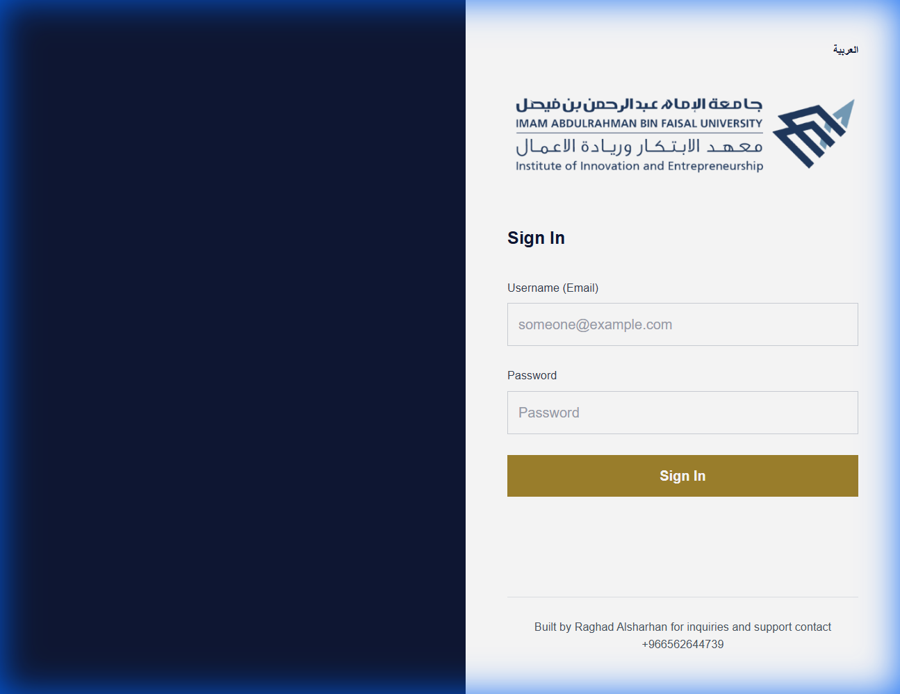
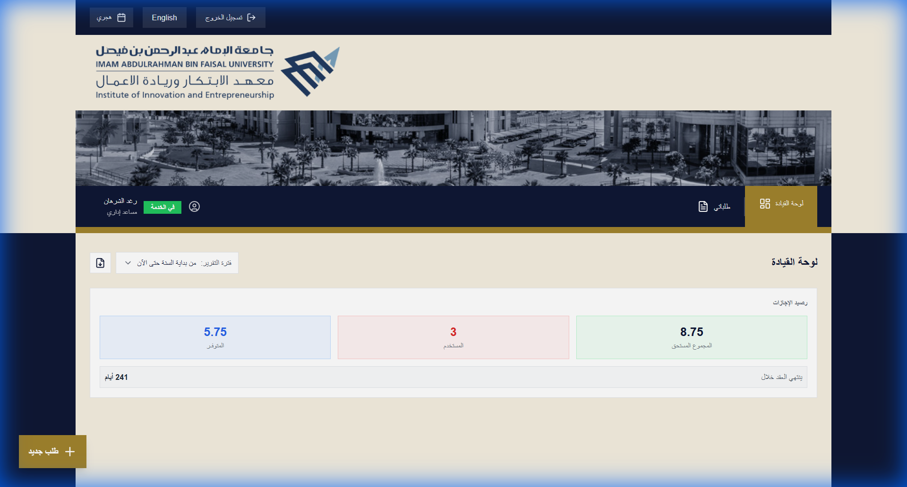
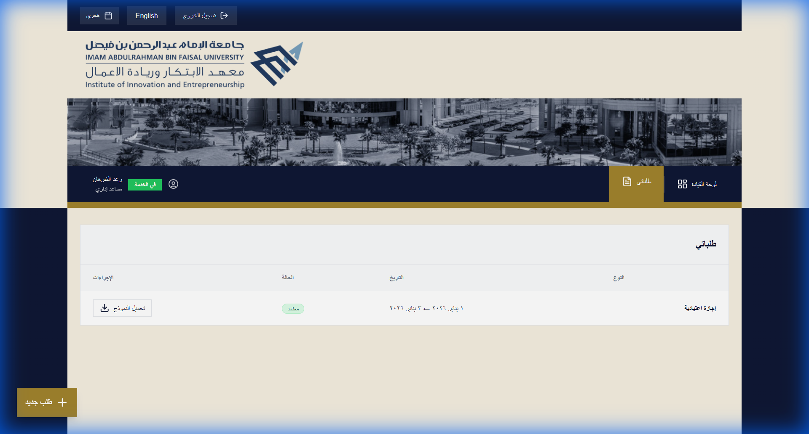
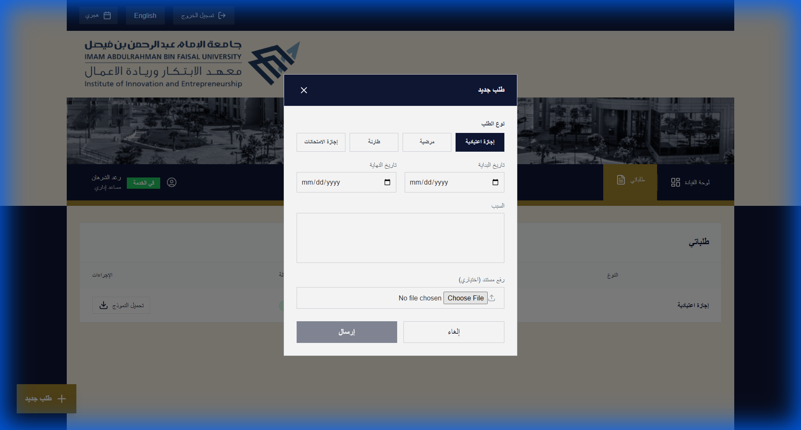
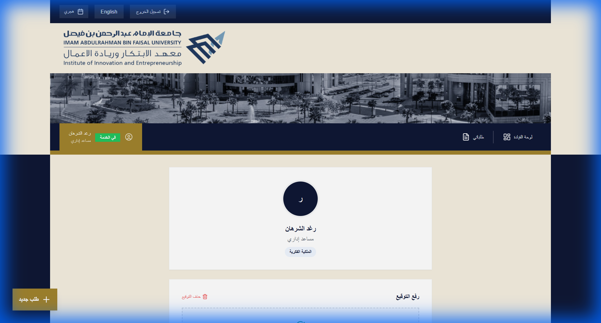
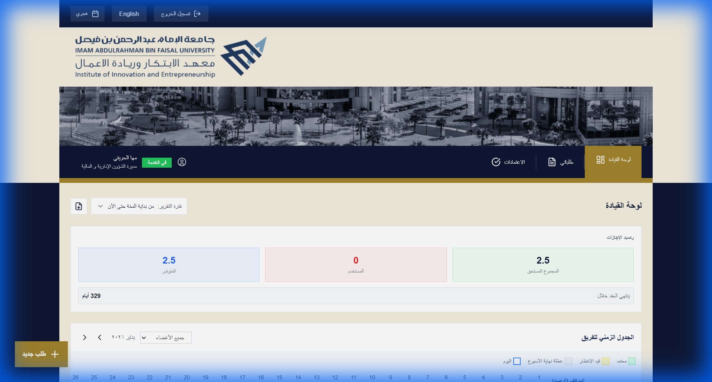
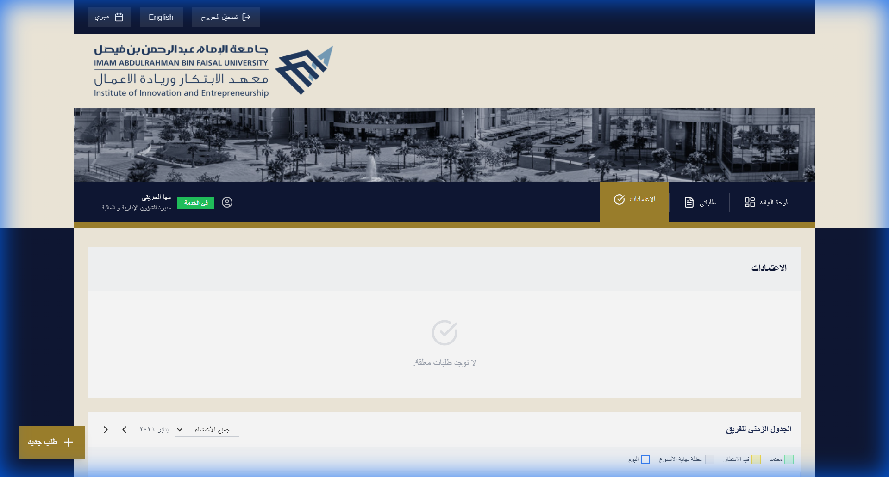

# بوابة جامعة الإمام عبد الرحمن بن فيصل - دليل المستخدم (الموظف والمدير)

## مقدمة
مرحبًا بك في **بوابة إدارة الإجازات**. يتيح هذا النظام للموظفين طلب الإجازات ومتابعة أرصدتهم، كما يمكن المديرين من مراجعة الطلبات واعتمادها بكفاءة.

---

## 1. البدء

### تسجيل الدخول
قم بالدخول إلى البوابة عبر الرابط `http://portal.iau.edu.sa` (أو الرابط الداخلي الخاص بكم).
أدخل البريد الإلكتروني الجامعي وكلمة المرور.

---

## 2. نظرة عامة على لوحة المعلومات (Dashboard)
بعد تسجيل الدخول، ستظهر لك **لوحة المعلومات**. وهي المركز الرئيسي لجميع بياناتك.

### الميزات الرئيسية:
1.  **رصيد الإجازات**: عرض إجمالي الرصيد، المستخدم، والمتاح فورًا.
2.  **الجدول الزمني للفريق (Timeline)**: عرض تقويم يوضح من في إجازة حاليًا في قسمك.
3.  **تغيير اللغة**: التبديل بين العربية والإنجليزية باستخدام الزر في الزاوية العلوية.

---

## 3. إدارة طلبات الإجازة

### استعراض طلباتك
اضغط على **"طلباتي"** في القائمة الجانبية. ستظهر لك قائمة بجميع طلباتك السابقة والمعلقة.

### إنشاء طلب جديد
1.  اضغط على زر **"طلب جديد"** (عادةً زر + عائم أو خيار "طلب جديد").
2.  ستظهر نافذة النموذج. اختر **نوع الإجازة** (سنوية، مرضية، طارئة، إلخ).
3.  اختر **تاريخ البدء** و **تاريخ الانتهاء**.
4.  سيقوم النظام تلقائيًا بحساب المدة والتحقق من رصيدك.
5.  اضغط على **إرسال**.

> [!NOTE]
> ستصلك رسالة عبر البريد الإلكتروني عند اتخاذ مديرك إجراءً بشأن طلبك.

---

## 4. الملف الشخصي والتوقيع الرقمي
لتسهيل المعاملات اللاورقية، يمكنك رفع توقيعك الرقمي.

1.  اضغط على **اسمك** أو **صورة العرض** في الزاوية العلوية.
2.  اختر **الملف الشخصي**.
3.  تحت قسم **التوقيع**، قم برفع صورة لتوقيعك.
4.  سيتم تطبيق هذا التوقيع تلقائيًا على نماذج الإجازات المعتمدة.

---

## 5. للمديرين

### لوحة تحكم المدير والجدول الزمني
يتمتع المديرون بعرض متقدم للوحة المعلومات، يتضمن **الجدول الزمني للفريق** لتصور توافر الموظفين والتعارضات قبل اعتماد الطلبات.

### مراجعة الاعتمادات
انتقل إلى قسم **الاعتمادات**  (أو طلبات المدير) لإدارة الطلبات المعلقة.
-   **قبول**: يعتمد الطلب ويخصم من رصيد الموظف.
-   **رفض**: يرفض الطلب (يتطلب كتابة تعليق).

### إصدار التقارير
يمكن للمديرين تنزيل تقارير الإجازات مباشرة من لوحة المعلومات.
1.  اختر **فترة التقرير** (على سبيل المثال: هذا الشهر، الربع الماضي).
2.  اضغط على زر **تنزيل التقرير** (أيقونة بجانب القائمة) لتصدير البيانات.

---

## 6. الدعم الفني
إذا واجهت أي مشاكل (مثل خطأ في الرصيد، مشاكل في الدخول)، يرجى التواصل مع **مسؤول النظام** أو الدعم الفني لتقنية المعلومات.
