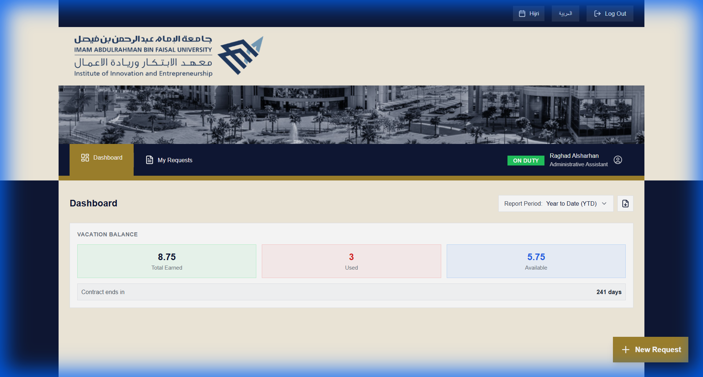
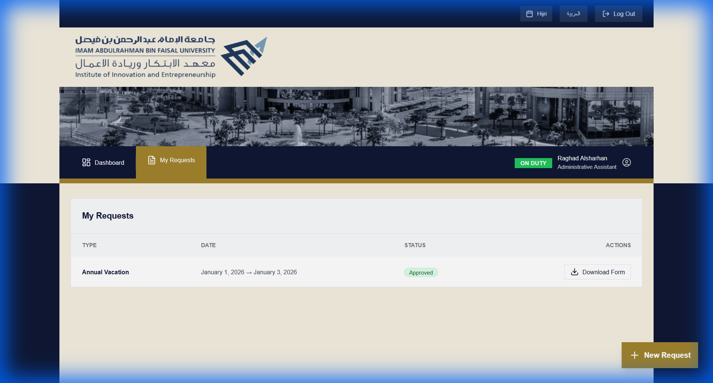
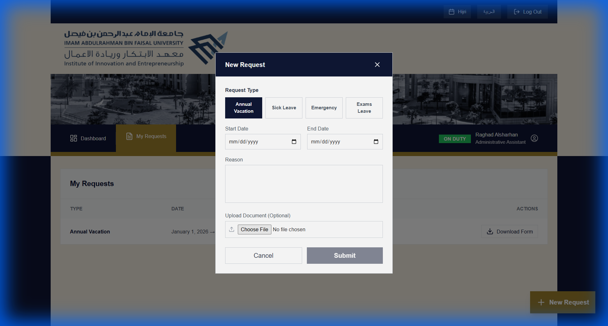
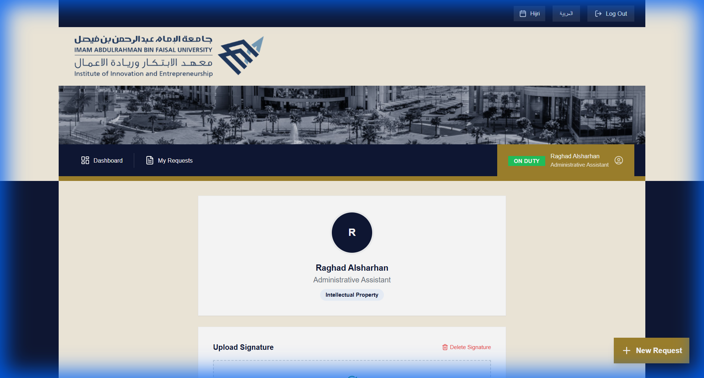
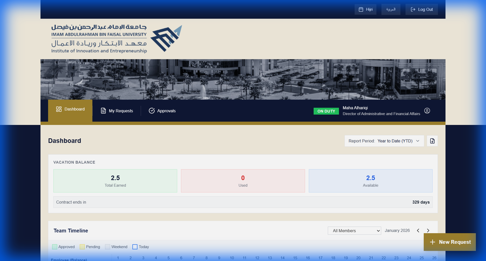
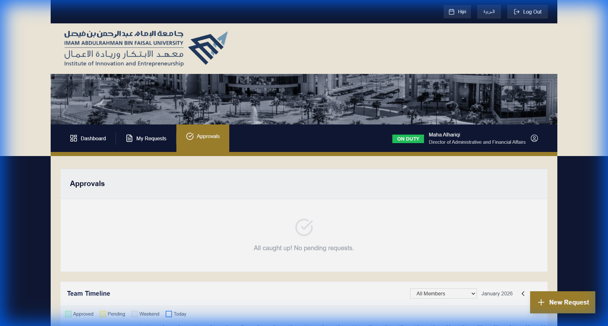

# IAU Portal - User Guide (Employee & Manager)

## Introduction
Welcome to the **IAU Leave Management Portal**. This system allows employees to request vacations, track their leave balances, and allows managers to review and approve requests efficiently.

---

## 1. Getting Started

### Login
Access the portal at `http://portal.iau.edu.sa` (or your internal URL).
Enter your university email and password.

---

## 2. Dashboard Overview
Upon logging in, you will see your **Dashboard**. This is your central hub for information.

### Key Features:
1.  **Vacation Balance**: View your Total, Used, and Available vacation days instantly.
2.  **Team Timeline**: A calendar view showing who is currently on leave in your department.
3.  **Language Toggle**: Switch between Arabic and English using the button in the top right corner.

---

## 3. Managing Leave Requests

### Viewing Your Requests
Click on **"My Requests"** in the sidebar. You will see a history of all your past and pending applications.

### Creating a New Request
1.  Click the **"New Request"** button (usually a floating + button or "New Request" action).
2.  A form will appear. Select the **Vacation Type** (Annual, Sick, Emergency, etc.).
3.  Choose your **Start Date** and **End Date**.
4.  The system will automatically calculate the duration and check your balance.
5.  Click **Submit**.

> [!NOTE]
> You will receive an email notification when your manager takes action on your request.

---

## 4. Profile & Digital Signature
To facilitate paperless processing, you can upload your digital signature.

1.  Click your **Name** or **Avatar** in the top right corner.
2.  Select **Profile**.
3.  Under the **Signature** section, upload an image of your signature.
4.  This signature will be automatically applied to approved vacation forms.

---

## 5. For Managers

### Manager Dashboard & Timeline
Managers have an enhanced view of the dashboard, featuring a **Team Timeline** to visualize team availability and overlaps before approving requests.

### Reviewing Approvals
Navigate to the **Approvals** section to manage pending requests.
-   **Approve**: Validates the request and updates the employee's balance.
-   **Reject**: Denies the request (requires a comment).

### Generating Reports
Managers can download vacation reports directly from the dashboard.
1.  Select the **Report Period** (e.g., this month, last quarter).
2.  Click the **Download Report** button (icon next to the selector) to export the data.

---

## 6. Support
If you encounter issues (e.g., incorrect balance, login errors), please contact your **Unit Admin** or the IT Helpdesk.
